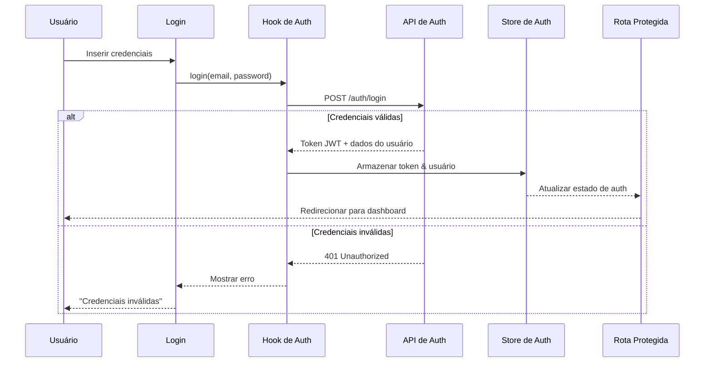
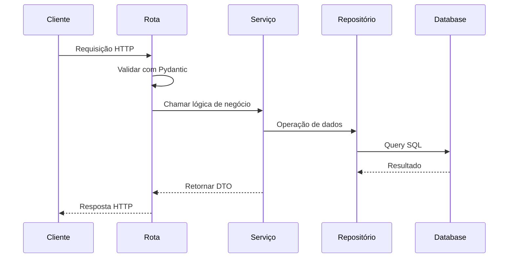
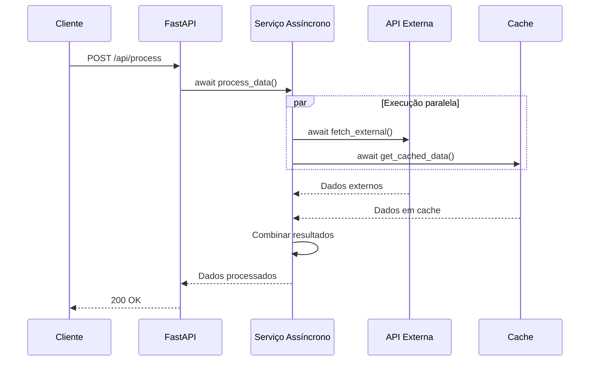
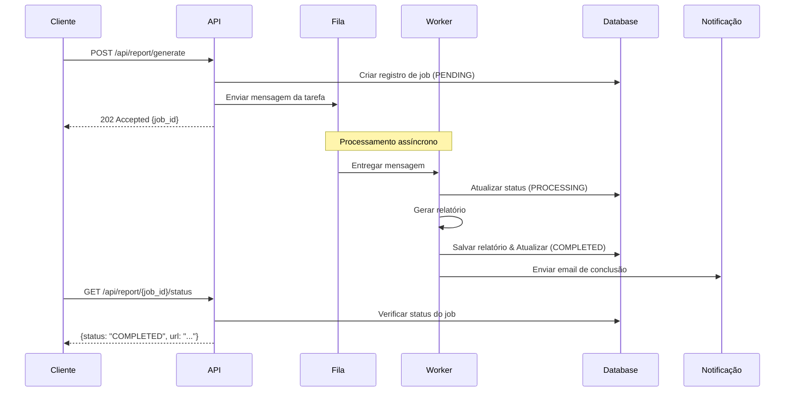
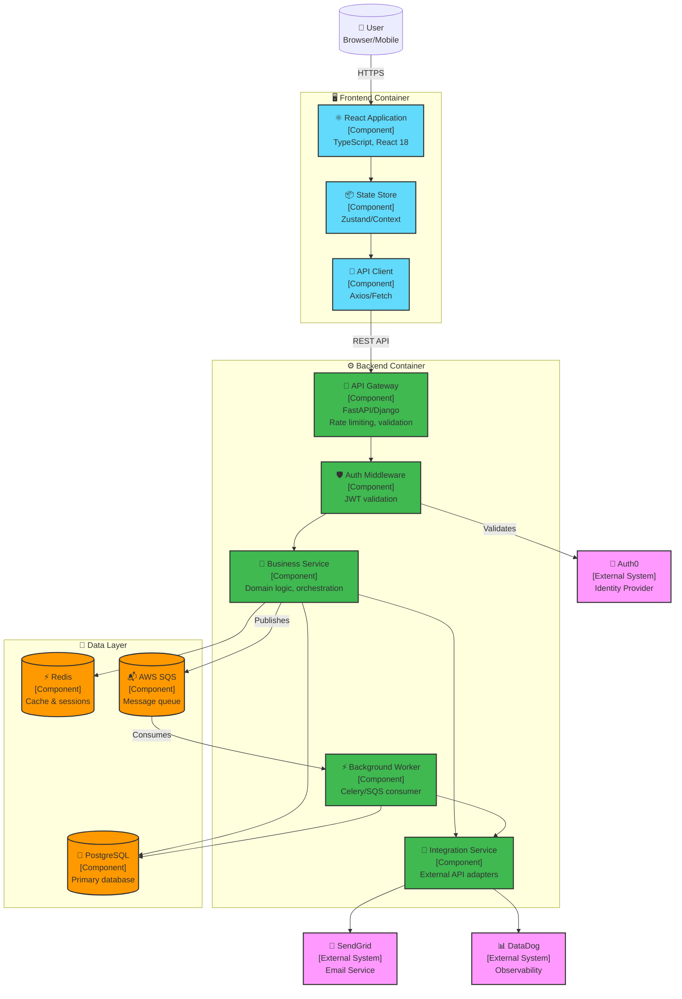
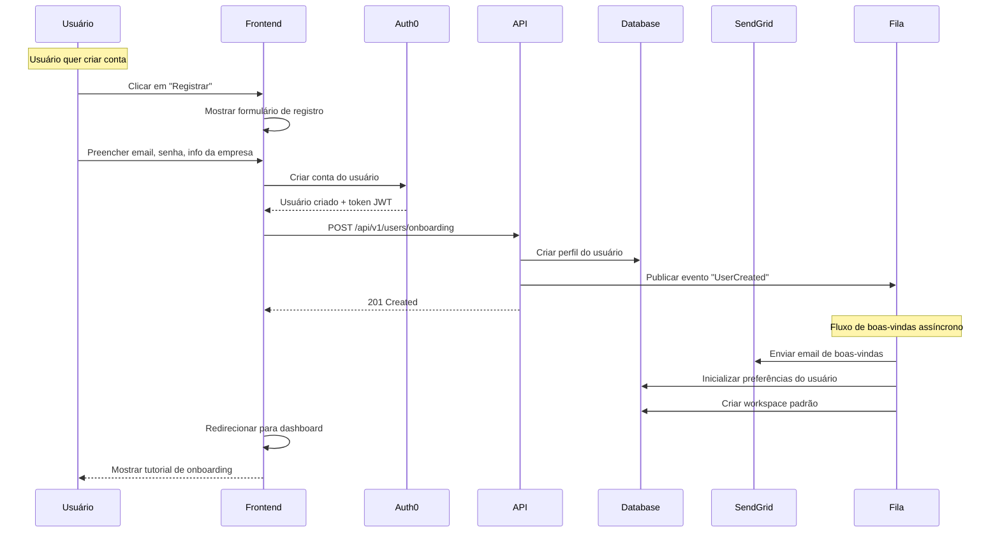
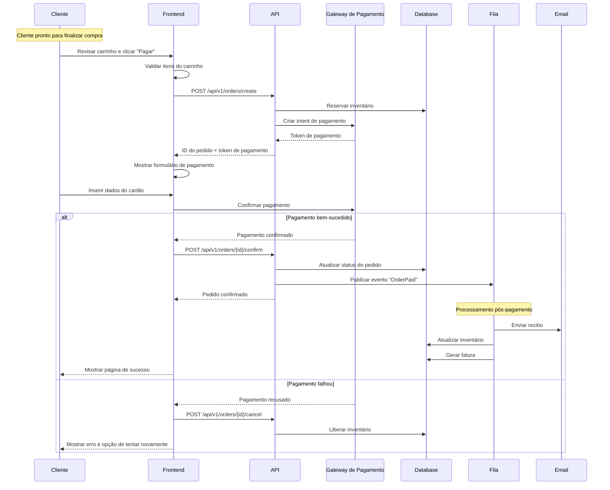
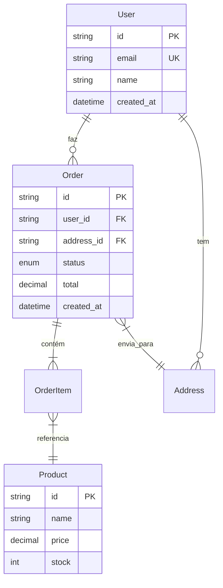

# Arquitetura

> **Definição arquitetural do sistema** - decisões, estrutura e padrões que governam o projeto.

## 🎯 Decisões Arquiteturais

> **Propósito**: Documentar as principais escolhas arquiteturais que precisam ser feitas para cada projeto, junto com seus trade-offs. Use estas informações para guiar decisões técnicas e garantir consistência na equipe.
>
> **Uso**: Ao enfrentar decisões arquiteturais, revise estes trade-offs para entender as implicações. Atualize esta seção quando novos padrões arquiteturais forem adotados ou quando trade-offs mudarem baseado nos requisitos do projeto.

### Decisões Arquiteturais do Projeto

#### Arquitetura de Serviços

| Decisão                     | Definição para Este Projeto                                 | Implicações Arquiteturais                                                                     |
| --------------------------- | ----------------------------------------------------------- | --------------------------------------------------------------------------------------------- |
| **Arquitetura de Serviços** | Monolith modular com feature modules isolados               | Todos os componentes fazem deploy juntos, database compartilhado, boundaries lógicas internas |
| **Padrão de Comunicação**   | Síncrono para operações críticas, async para notificações   | APIs REST para dados críticos, events/queues para workflows de background                     |
| **Consistência de Dados**   | Strong consistency para transações, eventual para analytics | Transações ACID na mesma database, eventos para propagação de mudanças                        |
| **Arquitetura do Cliente**  | API única para todos os clients com response adapters       | Uma API REST, formatação específica por client no frontend                                    |

#### Gerenciamento de Dados

| Decisão                    | Definição para Este Projeto                                             | Implicações Arquiteturais                                                                   |
| -------------------------- | ----------------------------------------------------------------------- | ------------------------------------------------------------------------------------------- |
| **Database Primário**      | PostgreSQL como database principal                                      | Todas as entidades core usam PostgreSQL, foreign keys garantem integridade, transações ACID |
| **Suporte Legacy**         | MySQL mantido para sistemas legados                                     | Dual-database durante migração, jobs ETL para sincronização de dados críticos               |
| **Estratégia de Exclusão** | Soft deletes para dados críticos, hard deletes para logs/cache          | Timestamps deleted_at, queries filtradas por padrão, compliance com GDPR                    |
| **Estratégia de Chaves**   | UUIDs para entidades principais, auto-increment para audit/logs         | Sistema distribuído amigável, evita colisões em microservices                               |
| **Consistência de Dados**  | Strong consistency para transações financeiras, eventual para analytics | Transações críticas usam database transactions, eventos assíncronos para dados não-críticos |

#### Estratégia de Cache

| Decisão                 | Definição para Este Projeto                                                                           | Implicações Arquiteturais                                                     |
| ----------------------- | ----------------------------------------------------------------------------------------------------- | ----------------------------------------------------------------------------- |
| **Tecnologia de Cache** | Redis como cache distribuído                                                                          | Todos os serviços compartilham mesma instância Redis, clustering para HA      |
| **Padrões de Cache**    | Cache-aside para dados de leitura, write-through para sessões                                         | Aplicação controla ciclo de vida do cache, Redis Cluster para particionamento |
| **Estratégia de TTL**   | TTL baseado na criticidade: sessões de usuário (24h), dados de negócio (5min), configs estáticas (1h) | Auto-expiração reduz uso de memória, TTLs diferentes por namespace            |
| **Invalidação**         | Invalidação manual para mudanças críticas, lazy loading para o resto                                  | Cache keys estruturadas com prefixos, padrões de invalidação por domínio      |

#### Deploy

| Decisão                     | Definição para Este Projeto                            | Implicações Arquiteturais                                                                      |
| --------------------------- | ------------------------------------------------------ | ---------------------------------------------------------------------------------------------- |
| **Estratégia de Container** | Containers Docker via AWS ECS Fargate                  | Aplicações stateless, compliance com 12-factor app, scaling horizontal automático              |
| **Padrão de Deploy**        | Rolling deployment com health checks                   | Deployments sem downtime, health checks ALB obrigatórios, graceful shutdown handling           |
| **Promoção de Ambiente**    | pipeline dev → staging → produção                      | Infrastructure as Code (CDK), configurações específicas por ambiente via variáveis de ambiente |
| **Estratégia de Rollback**  | Rollback automatizado em caso de falha no health check | Definição de task anterior mantida, rollback em <5 minutos via update do serviço ECS           |

#### Estratégia de Testes

| Decisão               | Definição para Este Projeto                     | Implicações Arquiteturais                                                          |
| --------------------- | ----------------------------------------------- | ---------------------------------------------------------------------------------- |
| **Pirâmide de Teste** | 70% unitários, 20% integração, 10% E2E          | Loop de feedback rápido, testes unitários rodam em <2min, pipeline CI falha rápido |
| **Database de Teste** | Containers PostgreSQL para testes de integração | Dados de teste isolados, rollback de transações após cada teste, execução paralela |
| **Estratégia E2E**    | Playwright contra ambiente de staging           | Apenas fluxos críticos do usuário, execução headless, screenshot/vídeo em falhas   |
| **Teste de API**      | Validação de spec OpenAPI + testes de contrato  | Validação automática do schema da API, breaking changes detectados no CI           |

### Atributos de Qualidade

> **Propósito**: Definir os requisitos não-funcionais e estratégias para alcançá-los. Estes direcionam decisões arquiteturais e prioridades de implementação.
>
> **Uso**: Referencie estes ao projetar funcionalidades para garantir que requisitos de qualidade sejam atendidos. Use as estratégias como diretrizes de implementação para preocupações de performance, escalabilidade e confiabilidade.

| Atributo             | Estratégia Principal                      |
| -------------------- | ----------------------------------------- |
| **Performance**      | Cache estratégico, otimização de queries  |
| **Escalabilidade**   | Arquitetura stateless, scaling horizontal |
| **Disponibilidade**  | Redundância, health checks, failover      |
| **Confiabilidade**   | Padrões de retry, circuit breakers        |
| **Segurança**        | Defesa em profundidade, menor privilégio  |
| **Manutenibilidade** | Clean architecture, observabilidade       |

## 💻 Stack Tecnológico

> **Propósito**: Documentar as tecnologias e ferramentas aprovadas para o projeto. Isso garante consistência no desenvolvimento, reduz fadiga de decisão e permite compartilhamento de conhecimento.
>
> **Uso**: Use como fonte definitiva para escolhas tecnológicas. Ao adicionar novas ferramentas, avalie contra o stack existente para compatibilidade e expertise da equipe.

### Tecnologias Principais

| Camada              | Tecnologia            |
| ------------------- | --------------------- |
| **Frontend**        | React.js              |
| **Backend**         | FastAPI (primário)    |
| **Backend**         | Django (legacy)       |
| **API**             | Apenas REST           |
| **Database**        | PostgreSQL (primário) |
| **Database**        | MySQL (legacy)        |
| **Database**        | DynamoDB              |
| **Cache**           | Redis                 |
| **Fila**            | SQS                   |
| **Autenticação**    | Auth0                 |
| **Observabilidade** | DataDog               |

### Ferramentas de Desenvolvimento

| Categoria                    | Tecnologia                        |
| ---------------------------- | --------------------------------- |
| **Linguagens**               | TypeScript + Python 3.12          |
| **Gerenciamento de Pacotes** | npm + uv                          |
| **Containerização**          | Docker + docker-compose           |
| **Qualidade de Código**      | ESLint + Prettier + Ruff + mypy   |
| **Testes**                   | Jest/Vitest + pytest + Playwright |

### Infraestrutura

| Componente            | Tecnologia          |
| --------------------- | ------------------- |
| **Provedor de Cloud** | AWS                 |
| **Compute APIs**      | ECS Fargate         |
| **Compute Functions** | Lambda              |
| **Containers**        | Docker + ECR        |
| **CI/CD**             | GitHub Actions      |
| **IaC**               | AWS CDK             |
| **CDN**               | CloudFront          |
| **Secrets**           | AWS Secrets Manager |
| **Storage**           | S3                  |

## 🏢 Arquitetura do Sistema

> **Propósito**: Definir como o código deve ser estruturado e organizado no frontend e backend. Fornece padrões para desenvolvimento consistente e bases de código manteníveis.
>
> **Uso**: Siga estes padrões ao criar novas funcionalidades ou refatorar código. Use as definições de camada para determinar onde novo código deve ser colocado e como componentes devem interagir.

### Arquitetura do Frontend

#### Camadas Arquiteturais

| Camada                      | Propósito                                                | Implementação                   | Exemplos                        |
| --------------------------- | -------------------------------------------------------- | ------------------------------- | ------------------------------- |
| **Páginas**                 | Componentes de nível de rota, funcionalidades de negócio | Organização baseada em features | `/users`, `/dashboard`, `/auth` |
| **Componentes**             | Elementos de UI reutilizáveis                            | Princípios de atomic design     | `Button`, `Modal`, `UserCard`   |
| **Layouts**                 | Templates de estrutura de página                         | Padrão de composição            | `AppLayout`, `AuthLayout`       |
| **Camada de API**           | Comunicação com dados externos                           | Abstração de serviço            | `userService`, `authClient`     |
| **Gerenciamento de Estado** | Manipulação do estado da aplicação                       | Context + hooks customizados    | `useAuth`, `useUsers`           |
| **Configuração**            | Setup do ambiente e aplicação                            | Config centralizada             | Endpoints da API, feature flags |

### Padrões do Frontend

> **Uso**: Implemente estes padrões ao construir funcionalidades similares. Use o fluxo de autenticação como template para outros workflows iniciados pelo usuário que requerem comunicação com API e gerenciamento de estado.

#### Fluxo de Autenticação



### Gerenciamento de Estado

> **Uso**: Escolha o padrão apropriado de gerenciamento de estado baseado no escopo e complexidade dos seus dados. Comece com estado local e escale para padrões globais apenas quando necessário.

| Padrão               | Quando Usar                                     | Implementação            |
| -------------------- | ----------------------------------------------- | ------------------------ |
| **Estado Local**     | Estado específico do componente                 | `useState`, `useReducer` |
| **Prop Drilling**    | 2-3 níveis de componentes                       | Props normais            |
| **Context**          | Estado compartilhado de componente (tema, auth) | `useContext` + Provider  |
| **Store Global**     | Estado de negócio compartilhado da aplicação    | Zustand store            |
| **Estado do Server** | Cache de dados da API                           | React Query / SWR        |
| **Estado da URL**    | Estado na URL (filtros, paginação)              | Parâmetros React Router  |
| **Estado de Form**   | Estado de formulários                           | React Hook Form          |

### Arquitetura do Backend

#### Camadas Arquiteturais do Backend

| Camada           | Propósito                                 | Implementação                    | Exemplos                                  |
| ---------------- | ----------------------------------------- | -------------------------------- | ----------------------------------------- |
| **Domínios**     | Módulos de negócio específicos de domínio | Organização baseada em domínio   | `/user`, `/order`, `/payment`             |
| **Core**         | Preocupações transversais da aplicação    | Infraestrutura compartilhada     | `config.py`, `database.py`, `security.py` |
| **Integrações**  | Conectores de serviços externos           | Módulos específicos por provedor | `/aws`, `/email`, `/payment`              |
| **Models**       | Camada de dados e entidades de negócio    | SQLAlchemy/Django ORM            | `models.py`, migrações de database        |
| **Serviços**     | Orquestração da lógica de negócio         | Serviços de domínio              | `service.py`, regras de negócio           |
| **Repositórios** | Abstração de acesso aos dados             | Persistência de dados            | `repository.py`, lógica de query          |
| **Schemas**      | Validação e serialização de dados         | Schemas Pydantic/DRF             | `schemas.py`, contratos de API            |
| **Rotas**        | Definições de endpoints da API            | Rotas FastAPI/Django             | `routes.py`, handlers HTTP                |

### Fluxo do Backend



### Padrões do Backend

> **Uso**: Aplique estes padrões ao implementar funcionalidades similares. Use operações assíncronas para tarefas I/O-bound e jobs em background para processos de longa duração que não devem bloquear requests de usuário.

#### Operações Assíncronas (FastAPI)



#### Jobs em Background (Celery/SQS)



### Padrões de Resiliência

> **Uso**: Implemente estes padrões ao integrar com serviços externos ou lidar com falhas do sistema. Escolha padrões baseado em modos de falha e requisitos de recuperação.

| Padrão                 | Quando Usar                 | Implementação                    |
| ---------------------- | --------------------------- | -------------------------------- |
| **Retry with Backoff** | Falhas temporárias de rede  | Tentativas com delay exponencial |
| **Circuit Breaker**    | Proteger serviços instáveis | Fail-fast após threshold         |
| **Bulkhead**           | Isolar falhas               | Pool de conexões separados       |
| **Timeout**            | Prevenir travamento         | Limites em todas as chamadas     |
| **Fallback**           | Degradação graceful         | Cache ou resposta padrão         |
| **Rate Limiting**      | Proteger recursos           | Token bucket ou sliding window   |

## 📦 Componentes do Sistema

> **Propósito**: Fornecer uma visão de alto nível dos componentes do sistema e suas interações. Ajuda novos membros da equipe a entender a arquitetura do sistema e guia decisões de integração.

> **Uso**: Referencie ao planejar novas funcionalidades que cruzam fronteiras de componentes. Atualize quando novos sistemas externos forem integrados ou grandes mudanças arquiteturais forem feitas.

### Diagrama de Componentes C4



## Arquitetura de Segurança

> **Propósito**: Definir fronteiras de segurança, controles e estratégias de proteção de dados. Garante implementação consistente de segurança e ajuda a identificar vulnerabilidades potenciais.

> **Uso**: Consulte ao implementar autenticação, lidar com dados sensíveis ou integrar com sistemas externos. Use durante revisões de segurança e auditorias de compliance. Atualize quando requisitos de segurança mudarem.

### Autenticação & Autorização

| Component               | Method             | Implementation          | Scope               |
| ----------------------- | ------------------ | ----------------------- | ------------------- |
| **User Authentication** | OAuth 2.0 + OIDC   | Auth0 Universal Login   | End users           |
| **API Authentication**  | JWT Bearer tokens  | Auth0 issued tokens     | API access          |
| **Service-to-Service**  | Client Credentials | Auth0 M2M tokens        | Internal APIs       |
| **Authorization**       | RBAC + Scopes      | Auth0 roles/permissions | Fine-grained access |

### Fronteiras de Segurança

> **Uso**: Entenda essas fronteiras de confiança ao projetar interações do sistema. Implemente medidas de proteção apropriadas baseadas no nível de confiança de cada fronteira.

| Boundary                     | Protection Method                           | Trust Level   |
| ---------------------------- | ------------------------------------------- | ------------- |
| **Internet → API Gateway**   | Rate limiting, DDoS protection, WAF         | Untrusted     |
| **API Gateway → Services**   | JWT validation, HTTPS only                  | Authenticated |
| **Services → Database**      | Connection encryption, credentials rotation | Trusted       |
| **Services → External APIs** | API keys, circuit breakers, TLS             | Semi-trusted  |

### Proteção de Dados

> **Uso**: Aplique o nível de proteção especificado para cada tipo de dado em todo o sistema. Use essas diretrizes ao armazenar, transmitir ou processar informações sensíveis.

| Data Type             | Protection Level      | Implementation                    |
| --------------------- | --------------------- | --------------------------------- |
| **PII (email, name)** | Encrypted at rest     | AES-256, field-level encryption   |
| **Passwords**         | Never stored          | Auth0 handles authentication      |
| **API Keys**          | Secrets Manager       | AWS Secrets Manager with rotation |
| **Database**          | Encrypted connections | TLS 1.2+, encrypted RDS           |
| **Logs**              | Sanitized             | Remove PII, structured logging    |

### Controles de Segurança

> **Uso**: Implemente estes controles consistentemente em todos os pontos de entrada da aplicação e caminhos de processamento de dados. Monitore as métricas especificadas para garantir que controles estejam funcionando adequadamente.

| Control               | Implementation                     | Monitoring                 |
| --------------------- | ---------------------------------- | -------------------------- |
| **Input Validation**  | Pydantic schemas, sanitization     | Request validation errors  |
| **Output Encoding**   | JSON serialization, XSS prevention | Response format compliance |
| **HTTPS Enforcement** | TLS 1.2+ required                  | Certificate monitoring     |
| **CORS Policy**       | Whitelist allowed origins          | CORS violation logs        |
| **Rate Limiting**     | Token bucket per user/IP           | Rate limit breach alerts   |

## 📊 Estratégia de Observabilidade

> **Propósito**: Estabelecer padrões de monitoramento, logging e alertas para sistemas em produção. Permite debugging efetivo, otimização de performance e resposta a incidentes.

> **Uso**: Implemente estes padrões ao adicionar novas funcionalidades ou serviços. Use os thresholds para configurar alertas e os padrões de logging para debugging consistente. Referencie durante investigações de incidentes.

### Arquitetura de Monitoramento

| Layer              | Metrics                               | Implementation | Alerting Threshold      |
| ------------------ | ------------------------------------- | -------------- | ----------------------- |
| **Application**    | Response time, error rate, throughput | DataDog APM    | >5s p95, >2% error rate |
| **Infrastructure** | CPU, memory, disk usage               | DataDog Agent  | >80% sustained          |
| **Database**       | Query performance, connections        | RDS metrics    | >1s avg query time      |
| **External APIs**  | Latency, availability                 | Custom metrics | >10s timeout            |

### Estratégia de Logging

> **Uso**: Implemente logging estruturado usando estes formatos e políticas de retenção. Use tipos de log apropriados baseados na informação sendo capturada e seu uso pretendido.

| Tipo de Log           | Formato                 | Retenção | Propósito                      |
| --------------------- | ----------------------- | -------- | ------------------------------ |
| **Logs de Aplicação** | JSON estruturado        | 30 dias  | Debugging, trilha de auditoria |
| **Logs de Acesso**    | Common Log Format       | 90 dias  | Segurança, análise de uso      |
| **Logs de Erro**      | Stack traces + contexto | 90 dias  | Investigação de bugs           |
| **Logs de Auditoria** | Eventos imutáveis       | 7 anos   | Compliance, segurança          |

### Distributed Tracing

> **Uso**: Implemente tracing nestes pontos-chave para habilitar visibilidade end-to-end de requests. Use IDs de correlação para conectar operações relacionadas entre serviços.

| Componente                  | Dados do Trace                            | Correlação                           |
| --------------------------- | ----------------------------------------- | ------------------------------------ |
| **Requisições da API**      | ID da requisição, ID do usuário, endpoint | Ciclo de vida completo da requisição |
| **Queries do Database**     | Tempo de query, contagem de resultados    | Otimização de performance            |
| **Chamadas de API Externa** | Provedor, tempo de resposta               | Monitoramento de integração          |
| **Jobs em Background**      | Tipo de job, duração, status              | Rastreamento de operação assíncrona  |

### Estratégia de Alertas

> **Uso**: Configure alertas baseados nestes níveis de severidade e tempos de resposta. Garanta que procedimentos on-call correspondam aos caminhos de escalonamento definidos aqui.

| Severidade  | Tempo de Resposta | Escalonamento         | Exemplos                               |
| ----------- | ----------------- | --------------------- | -------------------------------------- |
| **Crítica** | Imediato          | Chamar equipe on-call | Serviço fora do ar, vazamento de dados |
| **Alta**    | 15 minutos        | Notificação da equipe | Alta taxa de erro, problemas de DB     |
| **Média**   | 1 hora            | Daily standup         | Degradação de performance              |
| **Baixa**   | Próximo dia útil  | Revisão semanal       | Planejamento de capacidade             |

## ⚠️ Padrões de Tratamento de Erros

> **Propósito**: Padronizar padrões de tratamento de erros em toda a aplicação para experiência de usuário consistente e debugging efetivo. Define como diferentes tipos de erros devem ser tratados e comunicados.

> **Uso**: Siga estes padrões ao implementar tratamento de erros em APIs e componentes frontend. Use o formato de erro para respostas de API consistentes e as estratégias de retry para integrações externas resilientes.

### Classificação de Erros

| Tipo                     | Escopo                      | Ação                       | Exemplo                         |
| ------------------------ | --------------------------- | -------------------------- | ------------------------------- |
| **Erros de Negócio**     | Falhas esperadas            | Erro estruturado 422       | Formato de email inválido       |
| **Erros de Validação**   | Problemas de entrada        | 400 Bad Request            | Campo obrigatório ausente       |
| **Erros de Autorização** | Acesso negado               | Respostas 401/403          | Token JWT inválido              |
| **Erros de Sistema**     | Problemas de infraestrutura | Respostas 500 + retry      | Falha de conexão com o database |
| **Erros de API Externa** | Falhas de terceiros         | Circuit breaker + fallback | Timeout do gateway de pagamento |

### Formato de Resposta de Erro

> **Uso**: Use esta estrutura JSON exata para todas as respostas de erro da API. Inclua códigos de erro apropriados e request IDs para debugging e correlação.

```json
{
  "error": {
    "type": "VALIDATION_ERROR",
    "message": "Invalid input provided",
    "code": "E1001",
    "details": [
      {
        "field": "email",
        "message": "Email format is invalid"
      }
    ]
  }
}
```

### Estratégias de Retry

> **Uso**: Aplique estes padrões de retry baseado no tipo de erro encontrado. Implemente exponential backoff para problemas de rede e respeite rate limits com delays apropriados.

| Error Type              | Retry Pattern           | Max Attempts | Backoff       |
| ----------------------- | ----------------------- | ------------ | ------------- |
| **Network Timeouts**    | Exponential backoff     | 3            | 1s, 2s, 4s    |
| **Rate Limits**         | Linear backoff          | 5            | 60s intervals |
| **Service Unavailable** | Circuit breaker         | N/A          | Fail fast     |
| **Temporary DB Issues** | Immediate + exponential | 2            | 100ms, 1s     |

### Logging & Correlação

> **Uso**: Use níveis de log apropriados baseado na severidade e propósito da informação. Sempre inclua correlation IDs para habilitar rastreamento de requests entre serviços.

| Log Level | Content                                  | Correlation          |
| --------- | ---------------------------------------- | -------------------- |
| **ERROR** | Stack trace, context, user impact        | Request ID, user ID  |
| **WARN**  | Recoverable issues, degraded performance | Request ID           |
| **INFO**  | Business events, successful operations   | Request ID           |
| **DEBUG** | Detailed flow information                | Request ID, trace ID |

### Tratamento de Erros no Cliente

> **Uso**: Implemente estes padrões em aplicações frontend para fornecer experiência de usuário consistente durante condições de erro. Priorize mensagens amigáveis ao usuário sobre detalhes técnicos.

| Frontend Pattern         | Implementation                | User Experience            |
| ------------------------ | ----------------------------- | -------------------------- |
| **Network Errors**       | Retry with user notification  | "Retrying connection..."   |
| **Validation Errors**    | Field-level error display     | Inline form validation     |
| **Authorization Errors** | Redirect to login             | Seamless re-authentication |
| **Server Errors**        | Fallback UI + error reporting | "Something went wrong"     |

## 🔄 Jornadas do Usuário

> **Propósito**: Documentar fluxos de trabalho chave do usuário para entender processos de negócio e interações do sistema. Ajuda a identificar pontos de integração e requisitos de fluxo de dados.

> **Uso**: Referencie ao implementar funcionalidades que abrangem múltiplos serviços ou ao entender requisitos de negócio. Use para validar que a implementação técnica suporta necessidades do usuário e processos de negócio.

### Jornada do Usuário: Onboarding de Novo Cliente



### Jornada do Usuário: Processar Pagamento



## 🔌 Padrões de API

> **Propósito**: Estabelecer padrões consistentes de design de API para interfaces previsíveis e manteníveis. Garante que consumidores de API tenham uma experiência consistente em todos os endpoints.

> **Uso**: Siga estes padrões ao projetar novas APIs ou modificar existentes. Use durante revisões de API para garantir consistência. Referencie ao escrever documentação de API ou guias de integração de cliente.

### Padrões REST

| Aspecto                 | Implementação                                                 |
| ----------------------- | ------------------------------------------------------------- |
| **Estrutura de URL**    | `/api/v1/resources` (kebab-case, plural)                      |
| **Métodos HTTP**        | CRUD padrão: GET, POST, PUT, PATCH, DELETE                    |
| **Formato de Resposta** | Envelope JSON `{data, meta, error}`                           |
| **Autenticação**        | Tokens JWT Bearer do Auth0                                    |
| **Versionamento**       | Caminho da URL `/api/v1/`                                     |
| **Paginação**           | `?page=1&page_size=20` (máx: 100)                             |
| **Rate Limiting**       | 1000 req/hora (GET), 100 req/hora (escritas)                  |
| **Ações**               | POST `/resources/{id}/actions/{verb}` para operações não-CRUD |

## 🗄️ Modelo de Dados

> **Propósito**: Documentar os relacionamentos de dados principais e estratégia de armazenamento. Fornece entendimento do fluxo de dados e ajuda a manter integridade referencial entre serviços.

> **Uso**: Referencie ao projetar novas funcionalidades que requerem armazenamento de dados ou ao entender relacionamentos de dados existentes. Use a estratégia de database para determinar onde diferentes tipos de dados devem ser armazenados.

### Visão Geral do Schema



### Estratégia de Database

> **Uso**: Selecione o database apropriado baseado nas características dos dados e requisitos de consistência. Use PostgreSQL para dados transacionais, Redis para cache e DynamoDB para workloads de alta escala, eventualmente consistentes.

| Database       | Uso                                        | Consistência   | ORM                  |
| -------------- | ------------------------------------------ | -------------- | -------------------- |
| **PostgreSQL** | Dados transacionais, operações financeiras | Forte (ACID)   | SQLAlchemy (FastAPI) |
| **MySQL**      | Apenas sistemas legados                    | Forte (ACID)   | Django ORM (Django)  |
| **DynamoDB**   | Dados de sessão, analytics, logs           | Eventual       | boto3 direto         |
| **Redis**      | Cache, dados temporários                   | Baseado em TTL | redis-py             |

## 🔗 Integrações Externas

> **Propósito**: Fornecer um framework consistente para documentar e implementar integrações com serviços externos. Garante padrões de integração robustos e manteníveis.

> **Uso**: Use este template ao planejar novas integrações com serviços externos. Documente cada integração seguindo este padrão para garantir consistência e completude. Referencie durante revisões de integração e troubleshooting.

### Template de Padrão de Integração

Para cada integração externa, documente:

1. **Contexto de Negócio** - Criticidade, impacto no sistema, requisitos de compliance
2. **Autenticação** - Métodos, políticas de rotação, estratégia de armazenamento
3. **Contrato da API** - Endpoints, rate limits, timeouts, políticas de retry
4. **Tratamento de Eventos** - Webhooks, estratégias de fallback, cenários de erro
5. **Padrões de Resiliência** - Circuit breakers, health checks, monitoramento
6. **Padrões de Implementação** - Segurança, testes, diretrizes de logging
