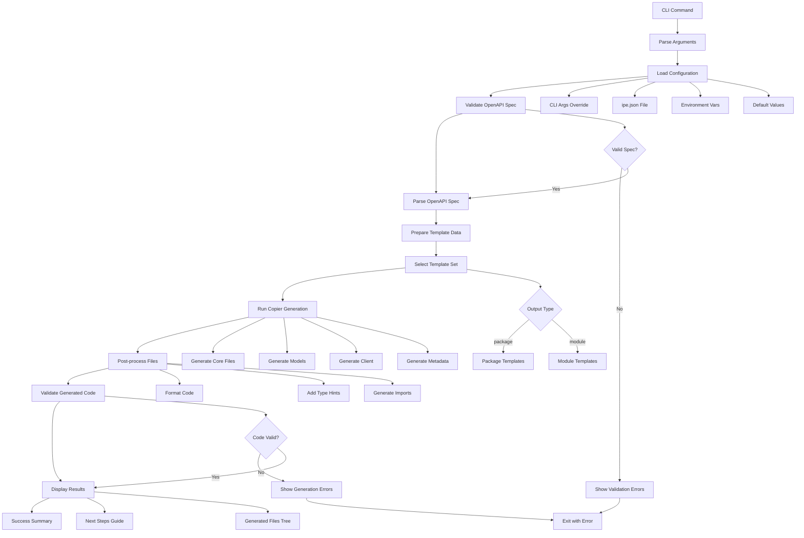

# Ipê - Technical Specification
*A next-generation OpenAPI code generator with an obsession for developer experience*

## Overview
Ipê is a blazingly fast, developer-first Python CLI tool that transforms OpenAPI specifications into beautiful, production-ready code. Named after the stunning Brazilian tree known for its vibrant blooms, Ipê brings the same elegance and reliability to code generation.

**Core Philosophy: Developer Experience Above All**
- ⚡ **Lightning Fast**: Sub-second generation for most specs
- 🎨 **Beautiful Output**: Rich CLI with progress indicators and syntax highlighting
- 🧠 **Intelligent Defaults**: Works perfectly out-of-the-box, customizable when needed
- 📚 **Exceptional Documentation**: Every feature explained with examples
- 🔧 **Extensible**: Plugin system for custom generators and templates

## Core Requirements

### 1. Command Line Interface

#### Core Commands
```bash
ipe generate SPEC [OPTIONS]    # Main generation command
ipe init                       # Interactive project setup
ipe validate SPEC              # Spec validation with detailed feedback
ipe generators                 # List available generators with examples
ipe doctor                     # Diagnose issues and suggest fixes
ipe version                    # Version info with ASCII art
```

#### Generate Command Options
```bash
ipe generate api.yaml \
  --generator python \           # Target language/framework
  --output ./client \           # Output directory
  --module-name my_api_client \ # Module name for generated code
  --config ./ipe.json \         # Config file path
  --dry-run \                   # Preview without writing
  --quiet \                     # Minimal output for CI
  --verbose                     # Detailed progress info
```

#### Primary Use Cases

**Quick Package Generation** (Most Common)
```bash
ipe generate api.yaml --output-type package --package-name my-api-sdk
```

**Embedded Module Generation**
```bash
ipe generate api.yaml --output-type module --output ./myapp/clients/
```

**Project Setup** (First-time Users)
```bash
ipe init  # Interactive setup with smart defaults and output type selection
```

**Development Workflow** (Active Development)
```bash
ipe generate api.yaml --watch --output-type package
```

**Custom Templates** (Advanced Users)
```bash
ipe generate api.yaml --template-dir ./templates --output-type package
```

**CI/CD Integration** (Automation)
```bash
ipe validate api.yaml && ipe generate api.yaml --quiet --output-type module
```

#### User Experience Design

**Beautiful CLI Output**
```
🌳 Ipê - OpenAPI Code Generator

✅ Validating OpenAPI specification...
📋 Found 25 endpoints, 12 models
🎯 Generating Python client...

  ⚡ Creating models...        ████████████████ 12/12
  🔧 Building client class...  ████████████████ 25/25
  📝 Writing documentation... ████████████████ 100%

🎉 Generated successfully!
   📁 Output: ./generated
   📊 Files: 15 created
   ⏱️  Time: 1.2s

💡 Next steps:
   • Install: pip install ./generated
   • Import: from generated import APIClient
   • Docs: ./generated/README.md
```

**Error Messages** (Helpful & Actionable)
```
❌ OpenAPI specification is invalid

📍 Error at line 42, column 15:
   Path: $.paths./users.get.responses.200
   Issue: Missing required field 'description'

💡 Suggestion:
   Add a description for the 200 response:

   responses:
     '200':
       description: 'List of users'
       content: ...

🩺 Run 'ipe doctor' for more detailed diagnostics
```

**Generated Code Structure**
```
generated/
├── 📄 README.md              # Usage examples
├── 📋 requirements.txt       # Dependencies
├── 🐍 __init__.py           # Package exports
├── 🔧 client.py             # Main API client
├── 📝 models/               # Data models
│   ├── __init__.py
│   ├── user.py
│   └── pet.py
├── 🔐 auth.py              # Authentication
└── ⚠️  exceptions.py        # Error handling
```

### 2. Code Generation Process Flow

The following diagram shows the complete generation process from CLI input to generated code:



#### Detailed Process Steps

**1. Configuration Loading** (Priority Order)
```python
config = ConfigManager().load_config(
    config_path=args.config,           # CLI --config arg
    generator=args.generator,          # CLI overrides
    output_type=args.output_type,      # CLI overrides
    # Falls back to ipe.json, then env vars, then defaults
)
```

**2. OpenAPI Specification Processing**
```python
# Validate spec format and required fields
validator = OpenAPIValidator()
validation_result = validator.validate(spec_path)

# Parse into structured data
parser = OpenAPIParser()
parsed_spec = parser.parse(spec_path)
```

**3. Template Data Preparation**
```python
template_data = {
    "spec": parsed_spec.model_dump(),
    "config": config.model_dump(),
    "package_name": config.package_name,
    "output_type": config.output_type,
    "operations": parsed_spec.get_operations(),
    "models": parsed_spec.get_models(),
    "auth_schemes": parsed_spec.get_auth_schemes(),
    # Template helpers and filters
    "filters": {
        "snake_case": to_snake_case,
        "camel_case": to_camel_case,
        "sanitize_name": sanitize_identifier,
    }
}
```

**4. Copier-Based Generation**
```python
from copier import run_copy

# Select appropriate template directory
template_path = get_template_path(config.generator, config.output_type)

# Generate code using Copier
run_copy(
    src_path=template_path,
    dst_path=config.output_dir,
    data=template_data,
    unsafe=True,  # Allow Jinja2 expressions
    conflict="overwrite"  # Handle existing files
)
```

**5. Post-Processing and Validation**
```python
# Format generated code
formatter = CodeFormatter(config.generator)
formatter.format_directory(config.output_dir)

# Validate generated code compiles/parses
validator = GeneratedCodeValidator(config.generator)
validation_result = validator.validate(config.output_dir)
```

### 3. Output Types and Use Cases

Ipê supports two fundamental output scenarios to cover different integration needs:

#### Installable Package Output
Generate a standalone, publishable package that can be distributed via PyPI or internal package repositories.

**Use Case**: Teams want to share API clients across multiple projects or publish public SDKs.

```bash
ipe generate api.yaml --output-type package --package-name my-api-sdk
pip install my-api-sdk  # After publishing
```

**Generated Structure**:
```
my-api-sdk/
├── pyproject.toml          # Package metadata & dependencies
├── README.md               # Usage documentation and examples
├── LICENSE                 # Package license
├── src/my_api_sdk/
│   ├── __init__.py         # Public API exports
│   ├── client.py           # Main API client class
│   ├── models/             # Pydantic data models
│   │   ├── __init__.py
│   │   ├── user.py
│   │   └── pet.py
│   ├── auth.py             # Authentication handling
│   └── exceptions.py       # Custom exception classes
└── examples/               # Usage examples
    └── basic_usage.py
```

#### Embedded Module Output
Generate code that integrates directly into an existing project structure.

**Use Case**: Teams want API clients as part of their main application codebase.

```bash
ipe generate api.yaml --output-type module --output-dir ./myapp/clients/
from myapp.clients.my_api_sdk import APIClient
```

**Generated Structure**:
```
myapp/clients/my_api_sdk/
├── __init__.py             # Client exports only
├── client.py               # Main API client class
├── models/                 # Pydantic data models
│   ├── __init__.py
│   ├── user.py
│   └── pet.py
├── auth.py                 # Authentication handling
└── exceptions.py           # Custom exception classes
```

### 3. Configuration System

#### JSON Configuration Schema
```json
{
  "generator": "python",
  "output_type": "package",
  "output_dir": "./generated",
  "template_dir": null,
  "spec_path": "openapi.yaml",
  "package_name": "api_client",
  "package_version": "1.0.0",
  "author": "Generated Code",
  "description": "Auto-generated API client",
  "package_manager": "uv",
  "generators": {
    "python": {
      "client_library": "httpx",
      "async_support": true
    }
  },
  "hooks": {
    "pre_generate": [],
    "post_generate": []
  },
  "template_globals": {}
}
```

#### Configuration File Locations (in order of precedence)
1. CLI `--config` argument
2. `./ipe.json` (project-specific config)
3. Built-in intelligent defaults ✨

### 3. Supported Generators

#### Python Generator
**Features:**
- Client classes with methods for each endpoint
- Pydantic models for request/response bodies
- Type hints throughout
- Async/sync client support
- Error handling classes
- Authentication support (API key, Bearer token, OAuth2)

**Output Structure:**
```
generated/
├── __init__.py
├── client.py
├── models/
│   ├── __init__.py
│   └── *.py (one per schema)
├── exceptions.py
└── auth.py
```

#### TypeScript Generator
**Features:**
- Interface definitions for all schemas
- Client class with typed methods
- Axios or Fetch-based HTTP client
- Response type definitions
- Error types

#### JavaScript Generator
**Features:**
- Client class with JSDoc annotations
- Optional TypeScript declaration files
- Modern ES6+ syntax
- Promise-based API

### 4. Template System

#### Template Engine: Jinja2
- **Template Directory Structure:**
```
templates/
├── python/
│   ├── client.py.j2
│   ├── models.py.j2
│   ├── exceptions.py.j2
│   └── __init__.py.j2
├── typescript/
│   ├── client.ts.j2
│   ├── types.ts.j2
│   └── index.ts.j2
└── shared/
    └── common.j2
```

#### Template Context Variables
- `spec`: Parsed OpenAPI specification
- `config`: Configuration object
- `generator`: Current generator name
- `package_name`: Target package name
- `operations`: List of all operations
- `schemas`: All schema definitions
- `paths`: All path definitions

#### Custom Jinja2 Filters
- `to_snake_case`: Convert to snake_case
- `to_camel_case`: Convert to camelCase
- `to_pascal_case`: Convert to PascalCase
- `sanitize_name`: Remove invalid characters for identifiers
- `format_docstring`: Format multi-line docstrings
- `resolve_ref`: Resolve $ref references

### 5. OpenAPI Specification Support

#### Supported OpenAPI Versions
- OpenAPI 3.0.x
- OpenAPI 3.1.x

#### Supported Features
- **Paths**: All HTTP methods, path parameters
- **Operations**: operationId, summary, description, tags
- **Parameters**: query, path, header, cookie parameters
- **Request Bodies**: JSON, form data, multipart
- **Responses**: Status codes, headers, content types
- **Schemas**: Objects, arrays, primitives, allOf, oneOf, anyOf
- **Security**: API keys, HTTP authentication, OAuth2, OpenID Connect
- **Components**: Reusable schemas, parameters, responses

#### Validation Requirements
- Valid OpenAPI specification format
- Required fields present
- Valid $ref references
- Supported content types
- Valid HTTP methods and status codes

### 6. Code Generation Requirements

#### Quality Standards
- **Type Safety**: Full type annotations where supported
- **Documentation**: Generate docstrings from OpenAPI descriptions
- **Error Handling**: Proper exception classes and handling
- **Validation**: Input validation using schema definitions
- **Code Style**: Follow language-specific conventions (PEP 8, etc.)

#### Performance Requirements
- Parse and generate for specs with 100+ endpoints in <5 seconds
- Incremental generation for watch mode
- Memory efficient for large specifications

### 7. Plugin System

#### Plugin Interface
```python
class GeneratorPlugin:
    name: str
    file_extensions: List[str]

    def generate(self, spec: OpenAPISpec, config: Config) -> List[GeneratedFile]
    def validate_config(self, config: Dict) -> bool
```

#### Plugin Discovery
- Entry points in `pyproject.toml`
- Dynamic loading at runtime
- Plugin validation and error handling

### 8. Error Handling

#### Error Categories
- **Specification Errors**: Invalid OpenAPI spec, parsing failures
- **Configuration Errors**: Invalid config, missing required fields
- **Template Errors**: Template syntax errors, missing templates
- **File System Errors**: Permission issues, disk space
- **Plugin Errors**: Plugin loading failures, runtime errors

#### Error Output Format
```json
{
  "error": "specification_invalid",
  "message": "OpenAPI specification is invalid",
  "details": {
    "line": 42,
    "column": 10,
    "path": "$.paths./users.get.responses",
    "issue": "Missing required field 'description'"
  }
}
```

### 9. Testing Requirements

#### Unit Tests
- OpenAPI spec parsing
- Template rendering
- Configuration handling
- Code generation logic
- Plugin loading

#### Integration Tests
- End-to-end generation workflows
- Real OpenAPI specifications
- Generated code compilation/execution
- CLI command testing

#### Test Coverage Target: 90%+

### 10. Performance Targets

#### Generation Speed
- Small spec (10 endpoints): <1 second
- Medium spec (50 endpoints): <3 seconds
- Large spec (200+ endpoints): <10 seconds

#### Memory Usage
- Maximum 500MB for largest supported specifications
- Streaming parsing for very large specs

### 11. Documentation Requirements

#### User Documentation
- Installation guide
- Quick start tutorial
- Configuration reference
- Template customization guide
- Plugin development guide

#### API Documentation
- Fully typed Python API
- Sphinx-generated documentation
- Code examples for all features

### 12. Distribution & Developer Experience

#### Package Structure
- PyPI package `ipe`
- Entry point: `ipe` command
- Python 3.9+ compatibility
- Cross-platform support (Windows, macOS, Linux)

#### Dependencies
- Core: `typer`, `copier`, `pydantic`, `pydantic-settings`, `httpx`, `rich`
- Dev: `pytest`, `ruff`, `mypy`, `pytest-cov`
- Optional: `watchfiles` (for watch mode)

#### Developer Experience Features
- **Rich CLI Output**: Beautiful progress bars, syntax highlighting, and emojis
- **Intelligent Error Messages**: Clear, actionable error messages with suggestions
- **Smart Defaults**: Zero-config setup for common use cases
- **Interactive Mode**: Guided setup with intelligent prompts
- **Real-time Feedback**: Watch mode with instant regeneration
- **Comprehensive Help**: Contextual help with examples for every command
- **Debug Mode**: Detailed diagnostic information for troubleshooting

## Development Plan & Current Status

### Phase 1: Core Foundation (Week 1) - ✅ COMPLETED
1. ✅ **Configuration System** - JSON config with pydantic validation (needed by everything)
2. ✅ **Error Handling & Rich Console** - Custom exceptions with beautiful Rich formatting
3. ✅ **OpenAPI Parser** - Pydantic models for OpenAPI 3.x specs
4. ✅ **Basic Validation** - Spec validation with detailed error reporting

### Phase 2: CLI Shell (Week 1-2) - ✅ COMPLETED
5. ✅ **Basic CLI App** - Typer app structure with Rich console
6. ✅ **Simple Commands** - version, doctor, generators (no dependencies)
7. ✅ **Command Routing** - Help system and error handling integration
8. ✅ **Testing Foundation** - Basic test structure and utilities with comprehensive standards

### Phase 3: Generation Engine (Week 2) - 🚧 IN PROGRESS
9. ✅ **Copier Integration** - Template management and generation with Copier
10. ✅ **Template Structure** - Modular template structure with separate modules, exceptions, and models
11. ✅ **Basic Python Generator** - Modular client generation with endpoint organization
12. 🚧 **Generator Testing** - Comprehensive unit tests for modular functionality

### Phase 4: Main Features (Week 2-3) - ⏳ PENDING
13. ⏳ **Generate Command** - Full implementation with options and validation
14. ⏳ **Interactive Init** - Project setup with smart defaults and prompts
15. ⏳ **Watch Mode** - File watching and auto-regeneration
16. ⏳ **Integration Testing** - End-to-end workflow testing

### Phase 5: Polish (Week 3) - ⏳ PENDING
17. ⏳ **Enhanced Error Messages** - Actionable suggestions and diagnostics
18. ⏳ **Progress Indicators** - Beautiful output with progress bars and emojis
19. ⏳ **Advanced Python Generator** - Async support, authentication, error handling
20. ⏳ **Comprehensive Testing** - Full test coverage and documentation

### Future Features (Planned for Later Releases)

**Watch Mode**
- Auto-regeneration when OpenAPI spec changes (`--watch` flag)
- Real-time file monitoring with intelligent debouncing
- Integration with development workflows

**Custom Templates**
- Support for user-defined Jinja2 templates (`--template-dir` option)
- Template inheritance system for extending built-in templates
- Plugin system for template modifications and custom generators

**Advanced Output Options**
- Multiple output types: package, module, standalone
- Package naming and structure customization
- Configurable file organization patterns

### Recent Accomplishments (Latest Updates)
- ✅ **Modular Output Structure** - Redesigned generator to create modular endpoint structure
- ✅ **Path-based Module Organization** - Implemented intelligent grouping by API version and resource
- ✅ **Separate Template Files** - Created dedicated templates for exceptions, models, client, and endpoints
- ✅ **Dataclass Models** - Updated model generation to use modern Python dataclasses
- ✅ **Comprehensive Testing Standards** - Established extensive testing guidelines and best practices
- 🚧 **Unit Test Implementation** - Creating comprehensive test suite for modular functionality

### Current Focus
- Implementing comprehensive unit tests for the new modular generation system
- Testing path parsing, module organization, and template data preparation
- Ensuring robust test coverage before proceeding with CLI integration testing

### Development Principles
- **Dependency-First**: Each phase builds on previous foundations
- **Incremental Testing**: Test each component as it's built
- **Early Validation**: Core functionality works before adding polish
- **Logical Progression**: From simple to complex, inside-out development
- **Milestone-Based**: Clear completion criteria for each phase
